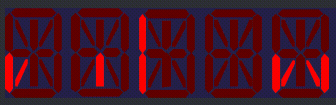

## LED Bus JS
### Pluggable LED display logic with scroll support

Encodes a string of text into series of on/off switch segment commands, with an optional scrolling ability.
This implementation is agnostic of specific visualisation method. So, you can use SVG (as in the example attached), canvas or plain HTML.

### Development

Prerequisites: 
[Git](https://git-scm.com), [NodeJS](https://nodejs.org) 

`git clone https://github.com/deviant-syndrome/led-bus`

`cd led-bus`

`npm install`

`npm run dev`

`npm run build`

### Acknowledgements

This small piece of software is heavily based on [Segmented LED Display - ASCII Library](https://github.com/dmadison/LED-Segment-ASCII) by 
[Dave Madison](https://github.com/dmadison), as it re-uses the HEX encoded ASCII font for 14-segment LED displays. 

The SVG representation of 14-segment LED display used is this project belongs to [pubic domain](https://commons.wikimedia.org/wiki/File:14-segment_display_A.svg).

#### TODOs

* Decimal point support in the example
* Ability to add custom characters
* Tests